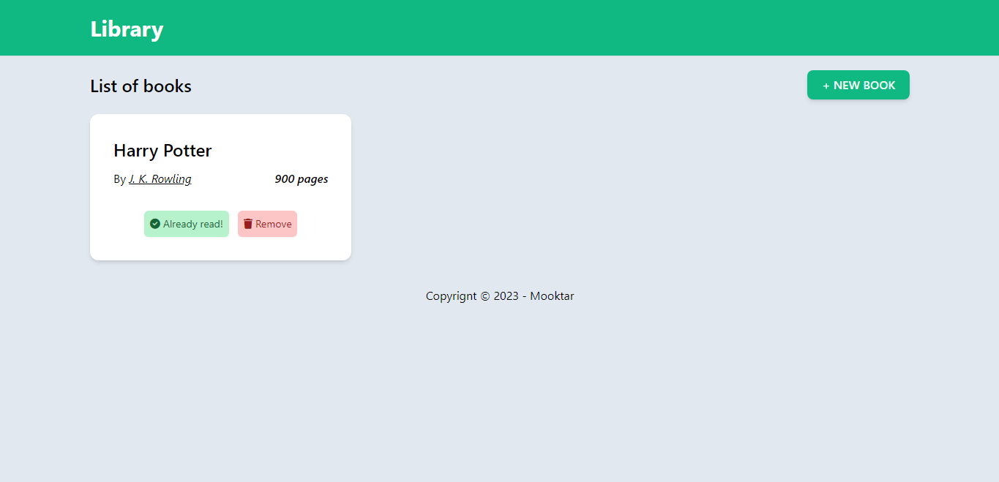

# Library
Library is an assignement from The Odin Project

## Screenshot



## Library stucture
```javascript
// List of books
const myLibrary = []

// Book constructor
function Book(title, author, pages, read) {
	this.title = title,
    this.author = author,
    this.pages = pages,
    this.read = read
}
```

## Demo
[Live preview](https://odin-library-gamma.vercel.app/)

## Contribution
Pull requests are welcome. For major changes, please open an issue first
to discuss what you would like to change.


## License
[MIT](https://choosealicense.com/licenses/mit/)